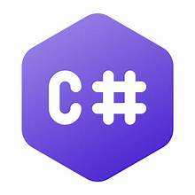
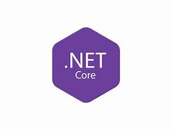

<h1 align="left" id="macropower-title">:wave: 🚀 Welcome to My GitHub – Innovation, Automation & Scalable Solutions</h1>

<h1 align="left" id="macropower-title"> I'm Snelisile Makhanya – Software Developer | Back-End </h1>

 
Hi there! I’m a results-driven Software Developer passionate about building scalable, high-performance back-end systems and data-driven applications. With expertise in Python, C#, .NET Core, Django, and SQL, I specialise in system optimisation, automation, and crafting robust software solutions tailored to real-world needs across different industries.
  
💡 <strong>What I Bring to the Table:</strong>

- 🔹 **Back-End Development** – Architecting efficient, maintainable, and scalable applications using Django, .NET Core, and ASP.NET.
- 🔹 **Database Mastery** – Proficient in SQL Server, MySQL, and SQLite, optimising queries for performance and scalability.
- 🔹 **Cloud & DevOps** – Deploying secure, containerised applications with Docker, CI/CD pipelines, and Git.
- 🔹 **Agile Collaboration** – Experienced in Agile teams, delivering high-quality software with TDD, debugging, and best coding practices.
- 🔹 **Mentorship & Code Reviews** – Improving software quality through structured code reviews, debugging guidance, and documentation.

🚀 <strong>What You’ll Find in My Repos:</strong>

🔍 I’m always open to collaboration, discussions, and exciting projects. Let’s build something impactful!

 

- 📧 **Email**: [snelisile@hotmail.com](mailto:snelisile@hotmail.com)
- 🔗 **LinkedIn**: [LinkedIn Profile](https://www.linkedin.com/in/snelisile-makhanya)

 

<h2 align="left" id="macropower-tech">I Code With</h2>

> Tools, languages, and other things that I like to work with.

<table>
  <tr>
    <td align="center" width="96">
      
       Python
    </td>
     <td align="center" width="96">
      
       C-Sharp
    </td>
    <td align="center" width="96">
      
       Django
    </td>
     <td align="center" width="96">
      
       .Net Core
    </td>
     <td align="center" width="96">
      
       SQLServer
    </td>
    <td align="center" width="96">
      
       PostgreSQL
    </td>
    <td align="center" width="96">
      
       HTML
    </td>
    <td align="center" width="96">
      
       CSS
    </td>
    <td align="center" width="96"> 
      
       Docker
    </td>
    <td align="center"  width="96">
      
       Git
    </td>
    <td align="center" width="96">
      
       MySQL
    </td>
  </tr>
</table>
